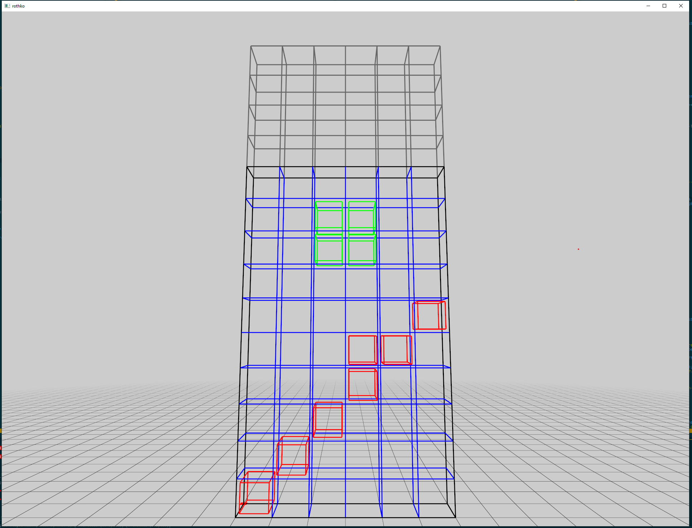
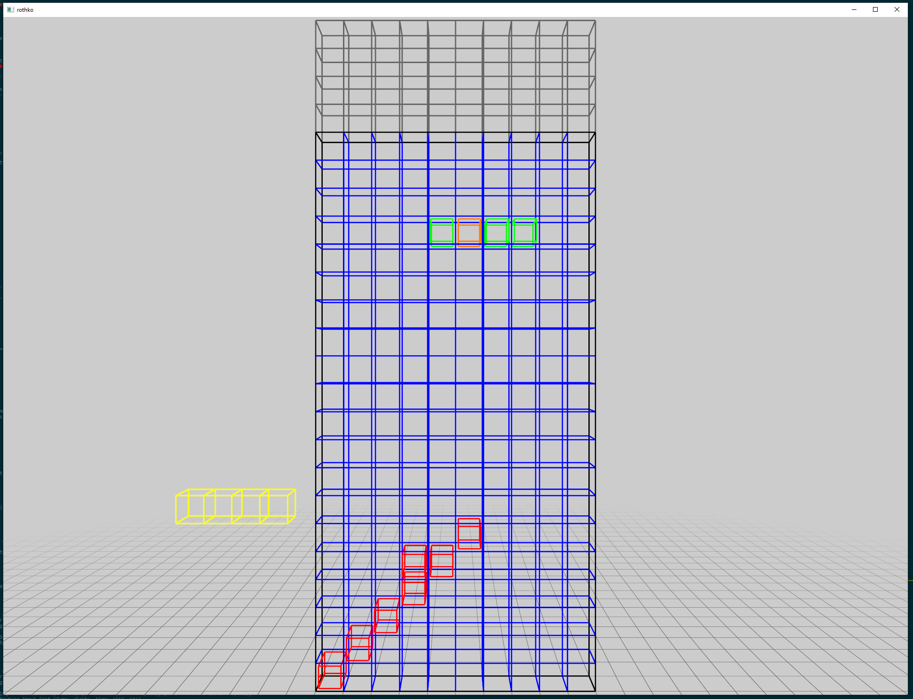
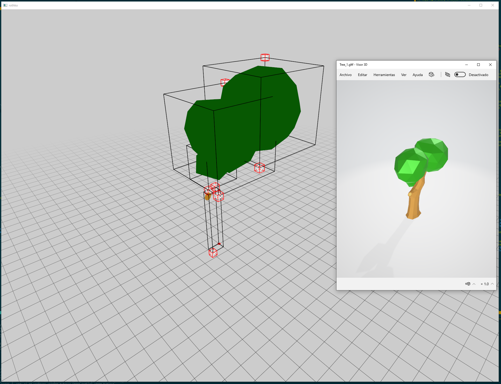
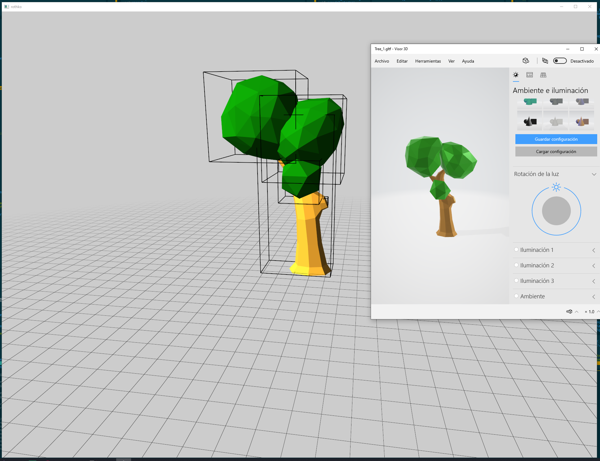
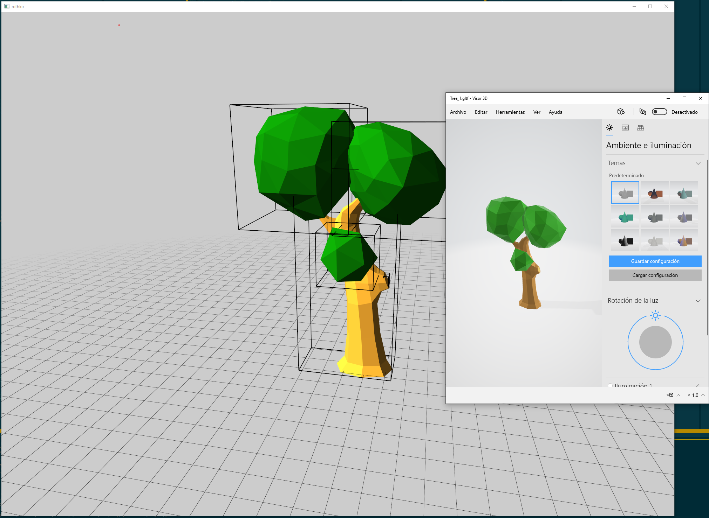
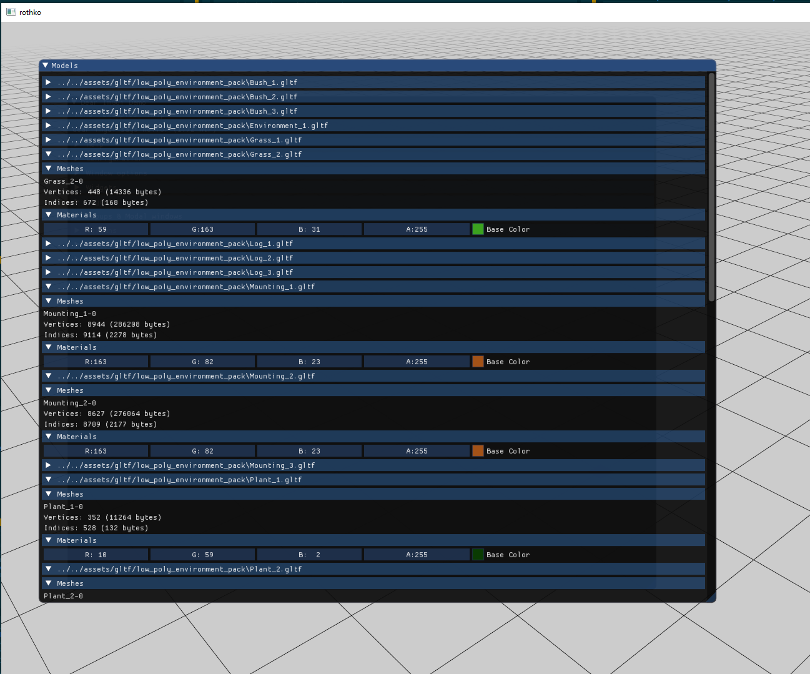
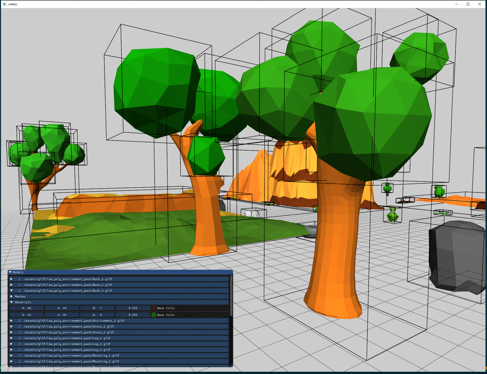

# Tetris Log

- Total hours: ~14.5

## Day 1 (~4 hours)

- Beginnings of a tetris examples.
  - Created a grid and is able to draw a cube in any coordinate with several colors.
  - Able to move shapes with arrow keys.
  - Able to detect collision when moving down and transform it into a dead cube (the game
    expects only one open shape.
- Simplified the window API a bit. Before it send a list of events per frame, now it only sends one.
- Added BIT_MASK macros to the math library. This permits to easily define several bit values in a
  bit field value. This is used in tetris to indicate which shape is active.

## Day 2 (~4 hours)

- Added all tetris shapes (L, reverse L, etc.).
- Shapes can now rotate. Rotation detects shape and border collision properly.
- Shapes now move automatically down.
- Better controls (keep pressed left/right).

## Day 3 (~1 hour)

- Started loading low poly environment pack for background graphics.
- Required handling a model with different vertex type (3d/Normal/UV) vs the already "supported"
  3d/Normal/Tangent/UV.
- Handle models without a baseColorTexture, that only uses a baseColorFactor.
- Initial load of a low poly tree. It doesn't have normal illumination and some parts of the model
  are missing.

## Day 4 (~1.25 hour)

- Corrected case where a glTF mesh would have many primitives. Before it would assume a 1:1 ratio.
- Correctly calculate bounds per primitive (not per mesh).
- Extended some Min/Max functions for vec3 and vec4.
- Added simple lighting shading.
- Node transformations seem to be off compared to the reference model.

## Day 5 (~2 hours)

- Getting transformation matrix from a quaternion. This will be needed because glTF rotation is
  stored as a quaternion instead of euler angles.
  - Getting the euler angles will be obtained by going to the transform matrix and back, but a more
    direct approach is warranted.
- Some minor fix to the grid widget.

## Day 6 (~1.5 hours)

- Finished quaternion to euler transformation. This makes a roundtrip from a transformation matrix,
  which is very unefficient, but will work for now.
- Modified the glTF loader to account for node translation. Now it works correctly!

## Day 7 (~1.5 hours)

- Added directory iteration to the platform API. Also permits filtering by file extension.
  - Only implemented for Windows and linux.
- Loaded all the low poly environment models at once using that API.
- Simplified the Imgui update API a bit and added some TODOs.

## Day 8 (~1.5 hours)

- Added a model instance, which permits to render a model with a transform.
- Added a StackAllocator (which simply increases the pointer from a base buffer).
  - This is used in order to store the transform and inverse transform of a model/mesh combo.
- Fixed a bug where materials would be wrongly tracked between nodes, incorrectly rendering
  materials.
- Loaded multiple models and rendered them in a scene.
