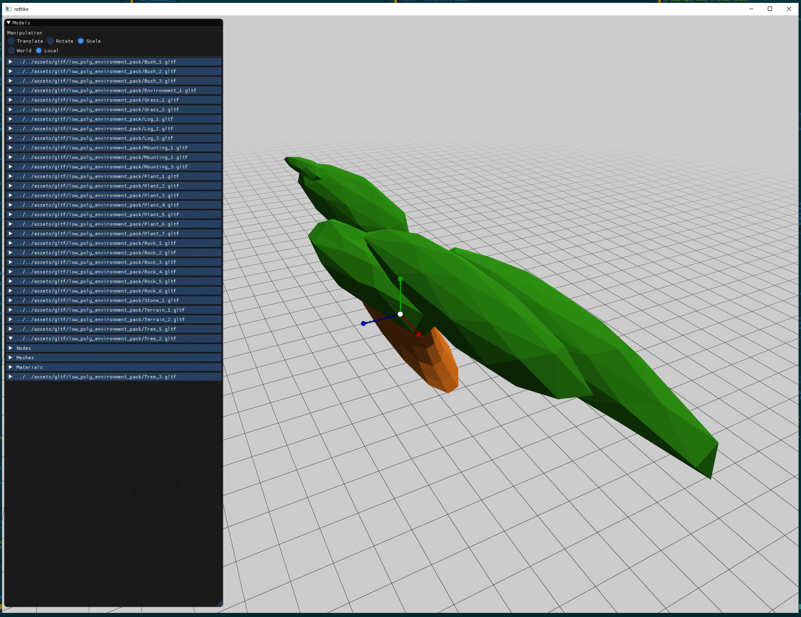
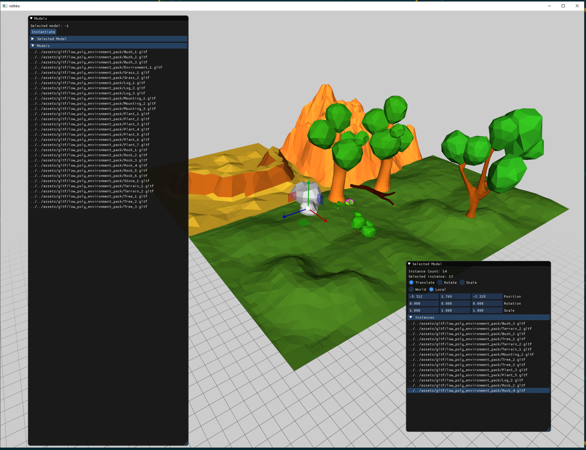

# Tetris Log

- Total hours: ~28

## Day 1: Initial gameplay skeleton.
### (~4 hours)

- Beginnings of a tetris examples.
  - Created a grid and is able to draw a cube in any coordinate with several colors.
  - Able to move shapes with arrow keys.
  - Able to detect collision when moving down and transform it into a dead cube (the game
    expects only one open shape.
- Simplified the window API a bit. Before it send a list of events per frame, now it only sends one.
- Added BIT_MASK macros to the math library. This permits to easily define several bit values in a
  bit field value. This is used in tetris to indicate which shape is active.

## Day 2: Overall playable prototype.
### (~4 hours)

- Added all tetris shapes (L, reverse L, etc.).
- Shapes can now rotate. Rotation detects shape and border collision properly.
- Shapes now move automatically down.
- Better controls (keep pressed left/right).

## Day 3: Initial glTF loading.
### (~1 hour)

- Advanced in the already existent glTF loading capabilities of Rothko.
- Started loading low poly environment pack for background graphics.
- Required handling a model with different vertex type (3d/Normal/UV) vs the already "supported"
  3d/Normal/Tangent/UV.
- Handle models without a baseColorTexture, that only uses a baseColorFactor.
- Initial load of a low poly tree. It doesn't have normal illumination and some parts of the model
  are missing.

## Day 4: Load glTF models.
### (~1.25 hour)

- Corrected case where a glTF mesh would have many primitives. Before it would assume a 1:1 ratio.
- Correctly calculate bounds per primitive (not per mesh).
- Extended some Min/Max functions for vec3 and vec4.
- Added simple lighting shading.
- Node transformations seem to be off compared to the reference model.

## Day 5: Quaternion support.
### (~2 hours)

- Getting transformation matrix from a quaternion. This will be needed because glTF rotation is
  stored as a quaternion instead of euler angles.
  - Getting the euler angles will be obtained by going to the transform matrix and back, but a more
    direct approach is warranted.
- Some minor fix to the grid widget.

## Day 6: Correct glTF loading.
### (~1.5 hours)

- Finished quaternion to euler transformation. This makes a roundtrip from a transformation matrix,
  which is very unefficient, but will work for now.
- Modified the glTF loader to account for node translation. Now it works correctly!

## Day 7: Loading multiple models.
### (~1.5 hours)

- Added directory iteration to the platform API. Also permits filtering by file extension.
  - Only implemented for Windows and linux.
- Loaded all the low poly environment models at once using that API.
- Simplified the Imgui update API a bit and added some TODOs.

## Day 8: Multiple model instances.
### (~2 hours)

- Added a model instance, which permits to render a model with a transform.
- Added a StackAllocator (which simply increases the pointer from a base buffer).
  - This is used in order to store the transform and inverse transform of a model/mesh combo.
- Fixed a bug where materials would be wrongly tracked between nodes, incorrectly rendering
  materials.
- Loaded multiple models and rendered them in a scene.

## Day 9: Transformable mdoel instances.
### (~3 hours)

- Moved the glTF loader from the glTF example to rothko.
- Added a bounds struct to the math library.
- [glTF example] Added a way to select and transform different model instances.

## Day 10: Initial Scene Editor.
### (~1.5 hours)

- Created a scene editor that permits to create model instances and modify their transform.
- Created a simple sample scene (picture).
  - Scene serialization is still TODO, so the scene is lost :(
- Fixed a bug where wireframe mode would not be forwarded.

## Day 11: Initial Scene Serialization.
### (~1.5 hours)

- Created a simple scene representation (models and instances).
- Wrote a simple serialization of models to a file.
- Started reading the file back.

## Day 12: Mesh serialization.
### (~1 hour)

- Formated the file to permit a "linked-list" of headers.
- Correctly exported a set of meshes and read it back.

## Day 13: Better scene serialization format.
### (~1.5 hours)

- Modified the format to make it more easily auditable with a hex editor, make it more easy to
  debug.
- Added initial texture serialization support (still not working).

## Day 14: Added texture to serialization format.
### (~2 hours)

- Modified the header so that it can support textures.
- Separeted scene serialization/deserialization into separate source files.

## Day 15: Added FNA-1a string hashing.
### (~1 hour)

- Permits to get a uint32_t hash from a string.
- Available in run-time and compime-time versions.
- Will permit to create a uint32_t identifier from the asset name.
